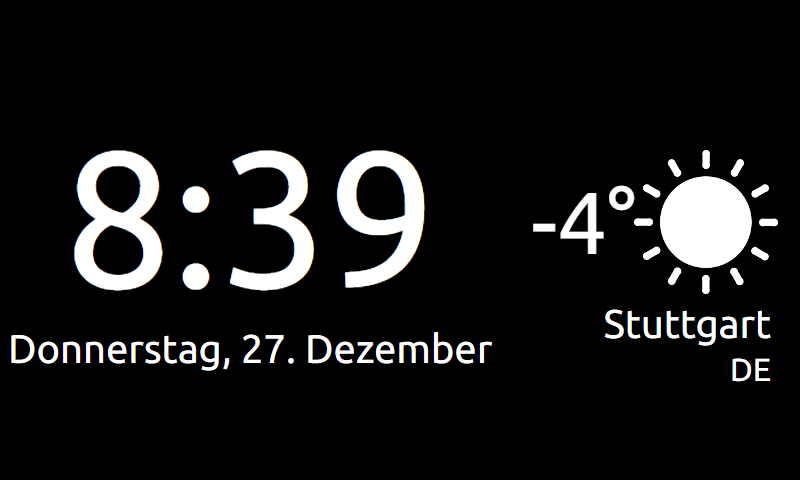

SmartMirror
=======================

Based on https://github.com/dabastynator/SmartMirror

Adapted to fit on a 5" 800x480 screen.

Make sure to create a 'magic_config.js' in the js folder, where you define the variables 'apiKey', 'city' and 'country'.

```javascript
var apiKey = "<replace_me>";
var city = "Stuttgart";
var country = "DE";
```



Simple setup example:

* disable screensaver on Raspian
* use a simple http server (e.g. serve on port 8080) on your Raspberry Pi with Raspian (Stretch)
* use the browser chromium in kiosk mode
```
http-server /path/to/repo -p 8080
chromium-browser --kiosk --app=localhost:8080 &
```

* write a script for autostart the browser in fullscreen (e.g.add `. /home/pi/myAutostartScript.sh` to '/etc/profile')


